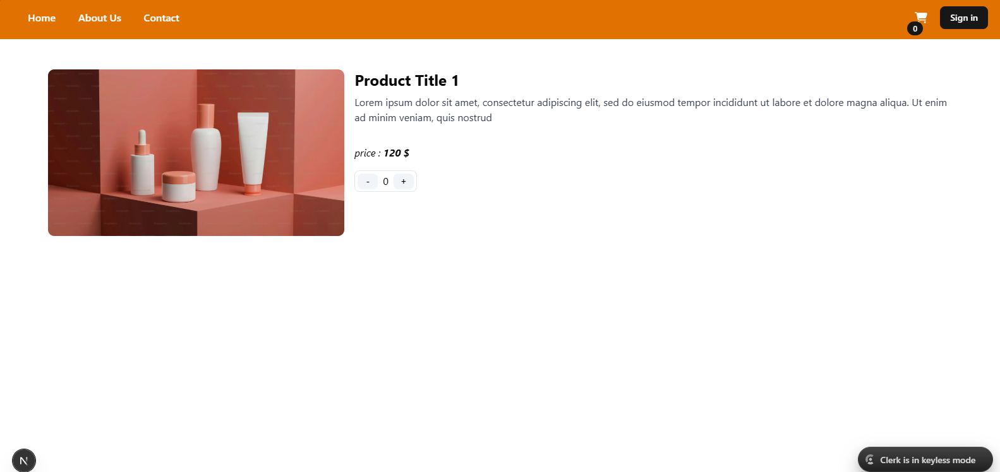
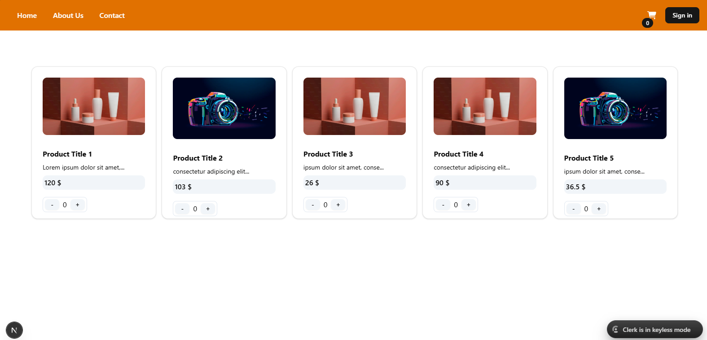

# Next Shop
## Technologies
nextjs | typescript | tailwindcss | shadcn | json-server | clerk (auth)


## Run

```bash
npm run dev
# or
yarn dev
# or
pnpm dev
# or
bun dev
```

## Additional information

The purpose of implementing this project is to familiarize yourself with and work with the nextjs framework and its features.
In this project, json-server is used for fake data and clerk is used for authentication. 
The focus is not on the UI.


## images

---

